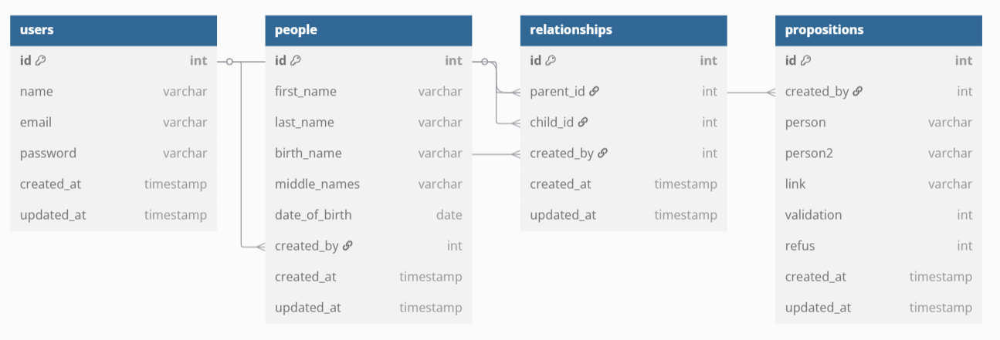

# Demo Généalogie Collaborative

Développement d’une application Laravel permettant la création de profils familiaux liés par relations, l’authentification d’utilisateurs, et la validation communautaire de propositions de liens familiaux.

## Fonctionnalités principales

**Gestion des personnes** : Création, consultation et modification des profils

**Système de parenté** : Création et proposition des liens familiaux entre personnes

**Workflow collaboratif** : Proposition et validation des modifications

**Authentification**: En s'inscrivant, se connectant, ou avec système d'invitation

## Structure de la base de données

### Demo video courte :

[Video 1 ](https://drive.google.com/file/d/1RSpbeD9qashCgYtAcTE1mT94uOop7TTL/view?usp=sharing):

- demonstration des restrictions par rapport au lien familiaux
- creation de compte associé a un profil
- creation des profils des membre de sa famille, et invitation via code

[Video 2](https://drive.google.com/file/d/1cLUrU0Tz_OED3ncRD4pwQmASI0NfcvQ9/view?usp=sharing) :

- demonstration des restrictions pour la proposition de liens familiaux
- validation d'une proposition par un des principaux concerné

### Compte Admin

'name' => 'Test User',

'email' => 'test@example.com',

'password'=> 'test',

## Routes API

### Authentification

- `POST /login` - Connexion utilisateur
- `POST /logout` - Déconnexion
- `GET /sign` - Page d'inscription
- `POST /checksign` - Traitement de l'inscription

### Invitation

- `GET /invitcode` - Page de code d'invitation
- `POST /checkinvit` - Validation du code d'invitation
- `POST /checksign2` - Traitement de l'inscription de l'invité et association avec son profil

### Gestion des personnes

- `GET /people` - Liste toutes les personnes
- `GET /people/{id}` - Affiche une personne spécifique
- `GET /create/{id}` - Formulaire de création (protégé)
- `POST /people` - Stocke une nouvelle personne (protégé)

### Workflow collaboratif

- `GET /proposer/{id}` - Page de proposition de modification
- `GET /saveproposition/{id}/{person}/{link}` - Sauvegarde une proposition
- `GET /listp` - Liste toutes les propositions
- `GET /valider/{p}/{p2}/{link}` - Valide une modification
- `GET /refuser/{p}/{p2}/{link}` - Rejette une modification

### Partie 2

- `GET /test-parentlink` - Test de la recherche de parenté

## Workflow des modifications

1. **Proposition** :

   - Un utilisateur authentifié propose un liens via `/proposer/{id}` pour d'autre personnes
   - La proposition est enregistrée dans `modifications` avec statut "pending"
3. **Validation/Rejet** :

   - Un autre utilisateur peut :
     - Valider (`/valider`) → applique les changements et met à jour le statut
     - Rejeter (`/refuser`) → marque la proposition comme rejetée

## Installation

### Prérequis

- PHP 8.0+

- Composer 2.0+

- MySQL/MariaDB

### Etapes

- Cloner le dépôt
- `composer install`
- Créer et configurer `.env`
- `php artisan migrate`
- cree un premier user dans phpmyadmin
- `php artisan serve`

## Tests partie 2

Le endpoint `/test-parentlink` permet de tester la recherche de liens familiaux avec une fonction recursive :

- Affiche le degré de parenté
- Montre le chemin entre deux personnes
- Donne des métriques de performance

## Développé par Yacine FEZOUI

yacine.fezoui2002@gmail.com

---

*Projet développé avec Laravel et MySQL*
